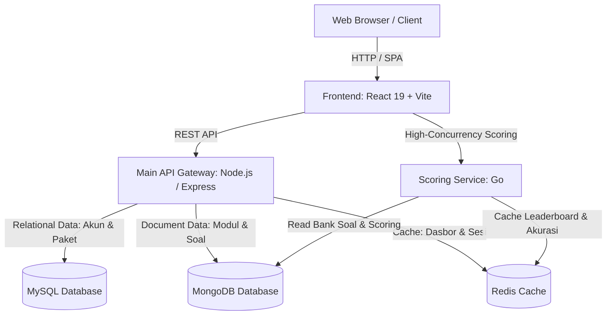

# Pasti Pintar LMS — Platform Belajar Digital & Dashboard

[](LICENSE)
[](https://react.dev/)
[](https://vitejs.dev/)
[](https://nodejs.org/)
[](https://golang.org/)
[](https://www.mysql.com/)
[](https://www.mongodb.com/)
[](https://redis.io/)

Platform Manajemen Pembelajaran (LMS) digital modern yang dirancang untuk persiapan ujian seleksi nasional (UTBK-SNBT, Sekolah Kedinasan, Ujian Mandiri PTN, dan CPNS). Sistem ini menyediakan antarmuka dasbor berkinerja tinggi dengan visualisasi analitik akurasi dan pelacakan progres belajar secara terpusat.

---

## 📑 Daftar Isi

- [Arsitektur Sistem](#-arsitektur-sistem)
- [Fitur Utama](#-fitur-utama)
- [Teknologi yang Digunakan](#-teknologi-yang-digunakan)
- [Struktur Proyek](#-struktur-proyek)
- [Prasyarat Sistem](#-prasyarat-sistem)
- [Panduan Instalasi & Menjalankan Proyek](#-panduan-instalasi--menjalankan-proyek)
  - [1. Clone Repositori](#1-clone-repositori)
  - [2. Menjalankan Database (Docker Compose)](#2-menjalankan-database-docker-compose)
  - [3. Menjalankan Backend API (Node.js)](#3-menjalankan-backend-api-nodejs)
  - [4. Menjalankan Scoring Service (Go)](#4-menjalankan-scoring-service-go)
  - [5. Menjalankan Frontend Dasbor (React + Vite)](#5-menjalankan-frontend-dasbor-react--vite)
- [Konfigurasi Environment](#-konfigurasi-environment)
- [Dokumentasi PRD](#-dokumentasi-prd)

---

## 🏛️ Arsitektur Sistem

Platform ini menerapkan pendekatan *polyglot microservices* sederhana untuk memisahkan beban kerja sesuai karakteristik layanannya:



---

## ✨ Fitur Utama

Berdasarkan spesifikasi PRD resmi, modul dasbor mencakup:

1. **Navigasi Global (*Floating Glass Pill*):**
   - Header persisten dengan efek *backdrop blur*.
   - Menu *dropdown* interaktif: **Bimbel** (UTBK-SNBT, Kedinasan, Ujian Mandiri, CPNS) dan **Paket Saya** (Paket Aktif & Riwayat).
   - Profil pengguna: **Production Admin** lengkap dengan status *Verified Admin* dan menu akun.
   - Responsif dengan *mobile drawer menu*.

2. **Welcome Section:**
   - Sapaan personal (*"Halo, Production Admin 👋"*).
   - Tombol cepat *"Kembali ke Home"*.
   - Kalender dinamis berbahasa Indonesia dan indikator status *LMS Core Live*.

3. **Akses Cepat (*Quick Access Bento Cards*):**
   - 4 kartu pintasan berarsitektur *Double-Bezel* (Nested Outer Shell + Inner Core):
     - 🎬 **Video Materi:** Modul video teori beresolusi tinggi.
     - 📝 **Tryout Online:** Simulasi CAT standar IRT real-time.
     - 📚 **Paket Saya:** Manajemen kurikulum & kelas aktif.
     - 🛒 **Beli Paket:** Akses katalog pembelian paket belajar.

4. **Pelacakan Belajar (*Learning Progress Widget*):**
   - Menghitung progres berbasis bobot kombinasi penyelesaian materi video dan tryout.
   - Dilengkapi *state switcher* interaktif untuk menguji tampilan **Ada Paket Aktif** vs **State Kosong (*Belum ada paket aktif*)**.
   - Tautan *"Lihat semua"*.

5. **Analitik Pengguna (*Accuracy Widget*):**
   - *Radial gauge* SVG animasi gradien melingkar.
   - Metrik akurasi kumulatif real-time (misal: `84.5%` akurasi).
   - Rincian jumlah soal (misal: `186 benar dari 220 soal`).
   - Distribusi performa sub-kategori (Penalaran Umum, Kuantitatif, Literasi Indonesia & Inggris).
   - Tombol toggle untuk menguji *baseline state* `0%`.

6. **Katalog Paket Belajar (*Modal Overlay*):**
   - Muncul otomatis saat menekan *"Beli Paket"* atau *"Lihat Paket"*.
   - Memuat katalog paket *Paket Mandiri*, *Intensif Masterclass*, dan *Supercamp All-In VIP*.

7. **Footer Regulasi & Kebijakan:**
   - Profil resmi platform.
   - Regulasi: FAQ, Syarat & Ketentuan, Kebijakan Pembayaran, Kebijakan Pengembalian Dana (*Refund*).
   - Kontak bantuan dan alamat kantor operasional.

---

## 💻 Teknologi yang Digunakan

| Komponen | Teknologi | Keterangan |
|---|---|---|
| **Frontend** | React 19, Vite 8, Vanilla CSS | Arsitektur *Double-Bezel*, tipografi *Plus Jakarta Sans*, micro-interactions |
| **Icons** | Lucide React | Ikon ultra-presisi modern |
| **Main Backend** | Node.js, Express.js | API routing, autentikasi, manajemen paket belajar |
| **Scoring Service** | Go (Golang) | Servis performa tinggi & latensi rendah untuk kalkulasi tryout |
| **Relational DB** | MySQL | Penyimpanan data relasional akun, transaksi, dan kepemilikan paket |
| **Document DB** | MongoDB | Penyimpanan materi pembelajaran dan bank soal dinamis |
| **In-Memory Cache** | Redis | Caching widget dasbor, progres belajar, dan session |
| **Containerization**| Docker & Docker Compose | Orkestrasi database lokal terisolasi |

---

## 📁 Struktur Proyek

```plaintext
pasti-pintar-lms/
├── .agents/                    # Konfigurasi skill dan guidelines AI agent
├── backend-api/                # Layanan utama Node.js Express
│   ├── src/
│   │   ├── config/             # Koneksi database (mysql.js, mongo.js, redis.js)
│   │   └── index.js            # Entry point REST API
│   ├── package.json
│   └── package-lock.json
├── frontend/                   # Aplikasi antarmuka React + Vite
│   ├── public/                 # Static assets & favicons
│   ├── src/
│   │   ├── components/         # Komponen UI Dasbor
│   │   │   ├── AccuracyWidget.jsx
│   │   │   ├── Footer.jsx
│   │   │   ├── LearningProgressWidget.jsx
│   │   │   ├── Navbar.jsx
│   │   │   ├── PackageCatalogModal.jsx
│   │   │   ├── QuickAccessGrid.jsx
│   │   │   └── WelcomeSection.jsx
│   │   ├── App.jsx             # Layout & state utama
│   │   ├── index.css           # Design tokens & tema Vanilla CSS
│   │   └── main.jsx
│   ├── index.html
│   └── package.json
├── scoring-service/            # Layanan mikro kalkulasi tryout (Go)
│   ├── go.mod
│   └── main.go
├── tasks/                      # Dokumen PRD dan spesifikasi teknis
│   └── prd-dashboard-lms.md
├── docker-compose.yml          # Konfigurasi database MySQL, MongoDB, Redis
├── .env.example                # Template variabel lingkungan
└── README.md                   # Dokumentasi utama proyek
```

---

## ⚙️ Prasyarat Sistem

Sebelum menjalankan proyek, pastikan Anda telah menginstal perangkat lunak berikut:

* [Node.js](https://nodejs.org/) (versi 18.x atau lebih baru) & `npm`
* [Docker Desktop](https://www.docker.com/products/docker-desktop/) (dengan fitur Docker Compose aktif)
* [Go (Golang)](https://go.dev/) (versi 1.20 atau lebih baru)
* [Git](https://git-scm.com/)

---

## 🚀 Panduan Instalasi & Menjalankan Proyek

### 1. Clone Repositori
```bash
git clone https://github.com/nisfal/lms-pasti-pintar.git
cd lms-pasti-pintar
```

### 2. Menjalankan Database (Docker Compose)
Jalankan MySQL, MongoDB, dan Redis secara bersamaan:
```bash
docker-compose up -d
```
> Untuk memeriksa status container yang sedang berjalan:
> ```bash
> docker-compose ps
> ```

### 3. Menjalankan Backend API (Node.js)
Buka terminal baru:
```bash
cd backend-api
npm install
node src/index.js
```
*Server API akan aktif di port `3000` (Endpoint health check: `http://localhost:3000/api/health`).*

### 4. Menjalankan Scoring Service (Go)
Buka terminal baru:
```bash
cd scoring-service
go run main.go
```
*Layanan kalkulasi Go akan aktif di port `8080` (Endpoint health check: `http://localhost:8080/api/health`).*

### 5. Menjalankan Frontend Dasbor (React + Vite)
Buka terminal baru:
```bash
cd frontend
npm install
npm run dev
```
Buka peramban (*browser*) Anda di: **`http://localhost:5173/`**

---

## 🔐 Konfigurasi Environment

Salin file `.env.example` menjadi `.env` pada root direktori:

```bash
cp .env.example .env
```

Contoh isi konfigurasi:
```env
# MySQL Configuration
MYSQL_HOST=localhost
MYSQL_PORT=3306
MYSQL_USER=lms_user
MYSQL_PASSWORD=lms_password
MYSQL_DATABASE=lms_db

# MongoDB Configuration
MONGODB_URI=mongodb://localhost:27017/lms_db

# Redis Configuration
REDIS_HOST=localhost
REDIS_PORT=6379

# API Configuration
PORT=3000
NODE_ENV=development
```

---

## 📖 Dokumentasi PRD

Rincian kebutuhan fungsional dan kriteria penerimaan (*acceptance criteria*) dapat diakses pada dokumen:
👉 [tasks/prd-dashboard-lms.md](tasks/prd-dashboard-lms.md)

---

## 📄 Lisensi

Proyek ini didistribusikan di bawah lisensi [MIT](LICENSE).
Hak Cipta &copy; 2026 **Pasti Pintar Edutech Indonesia**.
