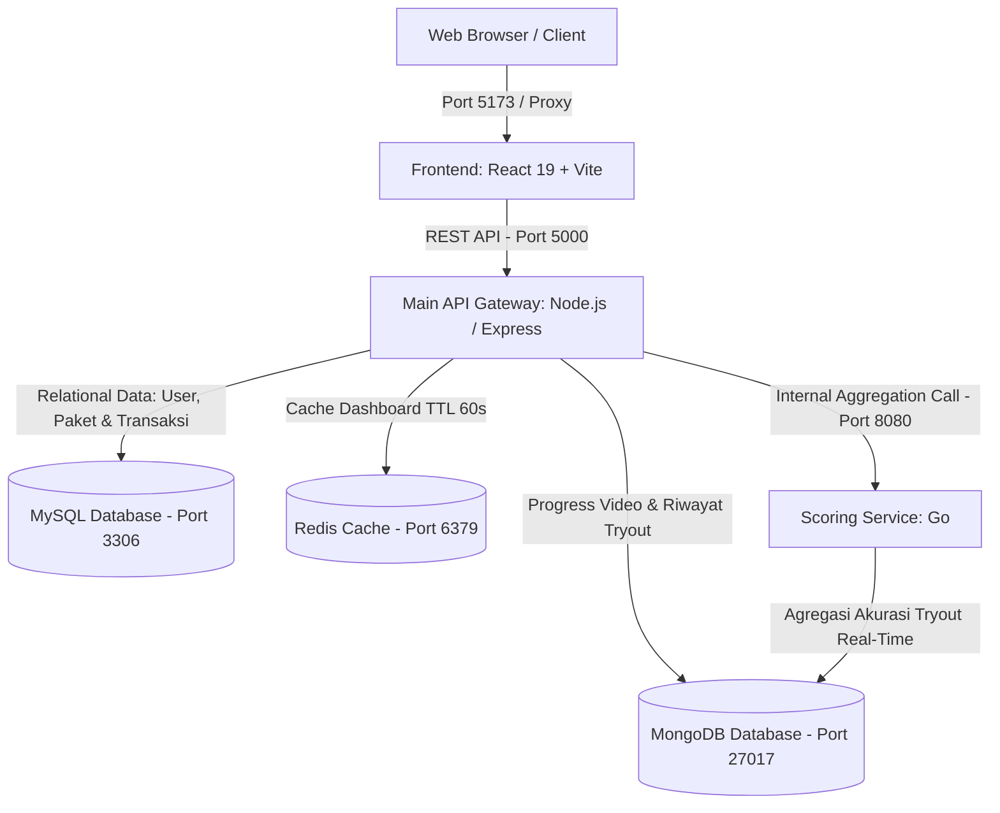

# Pasti Pintar LMS — Platform Belajar Digital & Dashboard

[](LICENSE)
[](https://react.dev/)
[](https://vitejs.dev/)
[](https://nodejs.org/)
[](https://golang.org/)
[](https://www.mysql.com/)
[](https://www.mongodb.com/)
[](https://redis.io/)

Platform Manajemen Pembelajaran (LMS) digital modern yang dirancang untuk persiapan ujian seleksi nasional (UTBK-SNBT, Sekolah Kedinasan, Ujian Mandiri PTN, dan CPNS). Sistem ini menyediakan antarmuka dasbor berkinerja tinggi dengan visualisasi analitik akurasi dan pelacakan progres belajar secara terpusat.

---

## 📑 Daftar Isi

- [Arsitektur Sistem](#-arsitektur-sistem)
- [Fitur Utama](#-fitur-utama)
- [Teknologi yang Digunakan](#-teknologi-yang-digunakan)
- [Struktur Proyek](#-struktur-proyek)
- [Prasyarat Sistem](#-prasyarat-sistem)
- [Panduan Instalasi & Menjalankan Proyek](#-panduan-instalasi--menjalankan-proyek)
  - [1. Clone Repositori](#1-clone-repositori)
  - [2. Database (Docker Compose)](#2-database-docker-compose)
  - [3. Database Seeder](#3-database-seeder)
  - [4. Scoring Service (Go)](#4-scoring-service-go)
  - [5. Backend API Gateway (Node.js)](#5-backend-api-gateway-nodejs)
  - [6. Frontend Dashboard (React + Vite)](#6-frontend-dashboard-react--vite)
- [Dokumentasi API](#-dokumentasi-api)
- [Konfigurasi Environment](#-konfigurasi-environment)
- [Dokumentasi PRD](#-dokumentasi-prd)

---

## 🏛️ Arsitektur Sistem

Platform ini menerapkan pendekatan arsitektur microservices terintegrasi dengan Node.js sebagai API Gateway terpusat:



### Alur Data Terintegrasi:
1. **Frontend** hanya memanggil endpoint terpadu `GET /api/dashboard/:userId` pada Node.js API Gateway (Port 5000).
2. **Node.js API Gateway**:
   - Memeriksa **Redis Cache** (`dashboard:${userId}`) terlebih dahulu. Jika ditemukan (*Cache HIT*), data langsung dikembalikan dalam hitungan milidetik.
   - Jika *Cache MISS*, Node.js mengambil profil siswa & paket aktif dari **MySQL**, progres video dari **MongoDB**, dan memanggil **Go Scoring Service** (Port 8080).
   - Menyimpan hasil gabungan ke Redis (TTL 60 detik) lalu mengembalikannya ke Frontend.
3. **Pembelian Paket**: Endpoint `POST /api/packages/purchase` menyuntikkan data langganan baru ke MySQL dan otomatis menginvalidasi cache Redis user terkait.

---

## ✨ Fitur Utama

Berdasarkan spesifikasi PRD resmi, modul dasbor mencakup:

1. **Navigasi Global (*Floating Glass Pill*):**
   - Header persisten dengan efek *backdrop blur* dan double-bezel styling.
   - Menu *dropdown* interaktif: **Bimbel** (UTBK-SNBT, Kedinasan, Ujian Mandiri, CPNS) dan **Paket Saya** (Paket Aktif & Riwayat).
   - Avatar dan profil dinamis pengguna yang tersinkronisasi dari database MySQL.

2. **Hero Sambutan & Navigasi Cepat:**
   - Sambutan personal dengan nama siswa, target universitas, program studi, dan tanggal hari ini.
   - 4 Kartu Akses Cepat (*Quick Access*): **Video Materi**, **CAT Tryout**, **Paket Saya**, dan **Eksplorasi Paket**.

3. **Widget Progress Belajar Paket Aktif:**
   - Menampilkan paket yang sedang aktif dari MySQL (`SNBT Masterclass 2026`).
   - Indikator progres gabungan dari video tuntas (10/14 video) dan jam belajar (465 menit).
   - Tombol toggle mode uji coba untuk memverifikasi kondisi *Ada Paket* vs *State Kosong* sesuai kriteria penerimaan PRD.

4. **Widget Akurasi Jawaban (Ditenagai Go Engine):**
   - Meter radial sirkular SVG dengan persentase akurasi kumulatif real-time (89.1%).
   - Pembagian detail performa sub-kategori:
     - **TPS - Penalaran Umum**: 93.3%
     - **Literasi Bahasa Indonesia**: 90.0%
     - **Literasi Bahasa Inggris**: 88.0%
     - **Penalaran Matematika**: 84.0%
   - Tombol toggle untuk menguji *Default State 0%* vs *Nilai Kumulatif Aktif*.

5. **Modal Katalog Paket Terpadu:**
   - Katalog paket resmi bimbingan belajar yang diambil langsung dari database MySQL.
   - Tombol pembelian langsung yang terintegrasi dengan endpoint backend untuk aktivasi instan.

---

## 🛠️ Teknologi yang Digunakan

| Komponen | Teknologi | Keterangan |
| --- | --- | --- |
| **Frontend** | React 19, Vite 8, Lucide React | Arsitektur SPA, Vanilla CSS, Zero Tailwind |
| **Backend API** | Node.js, Express, Mongoose, MySQL2, Redis Client | API Gateway & Orchestrator |
| **Scoring Service** | Golang (Go 1.25), Official Mongo Driver v2 | Komputasi & Agregasi Nilai Cepat |
| **Databases** | MySQL 8.0, MongoDB 8.2, Redis 7.4 | Polyglot persistence melalui Docker Compose |

---

## 📁 Struktur Proyek

```text
pasti-pintar-lms/
├── docker-compose.yml          # Konfigurasi container MySQL, MongoDB, Redis
├── .env.example                # Panduan variabel lingkungan
├── tasks/
│   └── prd-dashboard-lms.md    # Product Requirements Document resmi
├── scoring-service/            # Microservice Golang untuk Scoring & Akurasi
│   ├── go.mod
│   ├── go.sum
│   └── main.go                 # Engine kalkulasi akurasi berbasis MongoDB
├── backend-api/                # API Gateway Node.js Express
│   ├── package.json
│   ├── src/
│   │   ├── config/             # Konektor MySQL, MongoDB, dan Redis
│   │   │   ├── mysql.js
│   │   │   ├── mongo.js
│   │   │   └── redis.js
│   │   ├── database/
│   │   │   └── schema.sql      # DDL tabel MySQL (users, packages, user_packages)
│   │   ├── models/             # Mongoose Models (VideoProgress, TryoutRecord)
│   │   │   ├── TryoutRecord.js
│   │   │   └── VideoProgress.js
│   │   ├── routes/             # REST Endpoints
│   │   │   ├── dashboard.js
│   │   │   └── packages.js
│   │   ├── scripts/
│   │   │   └── seed.js         # Seeder otomatis MySQL & MongoDB
│   │   └── index.js            # Entry point Express API Server
└── frontend/                   # Web SPA React + Vite
    ├── package.json
    ├── vite.config.js          # Konfigurasi reverse proxy /api ke Port 5000
    ├── src/
    │   ├── components/         # Komponen UI Modular
    │   │   ├── Navbar.jsx
    │   │   ├── WelcomeSection.jsx
    │   │   ├── QuickAccessGrid.jsx
    │   │   ├── LearningProgressWidget.jsx
    │   │   ├── AccuracyWidget.jsx
    │   │   ├── PackageCatalogModal.jsx
    │   │   └── Footer.jsx
    │   ├── App.jsx             # Root layout & data fetching orchestrator
    │   └── index.css           # Design tokens, variables, & glassmorphism
```

---

## 🚀 Panduan Instalasi & Menjalankan Proyek

### 1. Clone Repositori

```bash
git clone https://github.com/nisfal/lms-pasti-pintar.git
cd lms-pasti-pintar
cp .env.example .env
```

### 2. Database (Docker Compose)

Pastikan Docker Desktop aktif, lalu jalankan seluruh container:

```bash
docker-compose up -d
```

### 3. Database Seeder

Isi database MySQL dan MongoDB dengan data inisial yang realistis:

```bash
cd backend-api
npm install
npm run seed
cd ..
```

### 4. Scoring Service (Go)

Jalankan scoring service pada port **8080**:

```bash
cd scoring-service
go run main.go
# Service aktif di http://localhost:8080
```

### 5. Backend API Gateway (Node.js)

Jalankan Express API pada port **5000**:

```bash
cd backend-api
npm start
# Server aktif di http://localhost:5000
```

### 6. Frontend Dashboard (React + Vite)

Jalankan Vite dev server pada port **5173**:

```bash
cd frontend
npm install
npm run dev
# Buka http://localhost:5173 di browser Anda
```

---

## 📡 Dokumentasi API

### 1. Dashboard Aggregation (`GET /api/dashboard/:userId`)
Menggabungkan data profil pengguna, paket aktif, statistik progres materi, dan evaluasi akurasi jawaban tryout.
- **Port:** `5000` (Node.js Gateway)
- **Cache:** Redis 60s TTL (`dashboard:${userId}`)
- **Response Contoh:**
  ```json
  {
    "status": "success",
    "cache": "MISS",
    "data": {
      "user": {
        "id": "usr_01",
        "name": "Nisrina Alifah",
        "targetMajor": "Pendidikan Dokter",
        "targetUniversity": "Universitas Indonesia"
      },
      "activePackage": {
        "title": "SNBT Masterclass 2026",
        "status": "Aktif",
        "validUntil": "2026-12-31"
      },
      "learningProgress": {
        "totalVideos": 14,
        "completedVideos": 10,
        "percentage": 71,
        "studyTimeMinutes": 465
      },
      "accuracy": {
        "percentage": 89.1,
        "totalQuestions": 110,
        "totalCorrect": 98,
        "latestScore": 760,
        "categories": [...]
      }
    }
  }
  ```

### 2. Accuracy Calculation Engine (`GET /api/accuracy/:userId`)
Dihitung langsung oleh microservice Golang dengan performa tinggi langsung dari koleksi MongoDB.
- **Port:** `8080` (Go Scoring Service)

### 3. Katalog Paket (`GET /api/packages`)
Mengambil daftar paket belajar aktif dari tabel `packages` MySQL.

### 4. Beli / Aktivasi Paket (`POST /api/packages/purchase`)
- **Body:** `{ "userId": "usr_01", "packageId": "pkg_snbt_2026" }`
- **Efek Samping:** Mengupdate tabel `user_packages` di MySQL dan otomatis menghapus cache Redis user terkait.

---

## 📄 Lisensi

Proyek ini dirilis di bawah lisensi [MIT](LICENSE).
